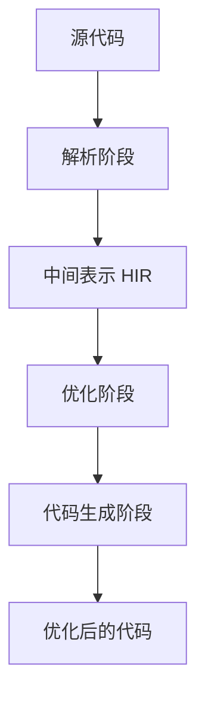

# React Compiler

## React Compiler 简介

React Compiler 是一个用 **Rust** 编写的**自动记忆化 (auto-memoization) 编译器**，它能够在构建阶段自动优化 React 应用代码。它的主要目标是解决 React 应用中**手动记忆化**的复杂性和维护负担，让开发者能够编写更简洁的代码，同时获得更好的性能表现。

### 为什么要使用 React Compiler？

在传统的 React 开发中，当组件的 props、state 或 context 发生变化时，React 会重新渲染该组件及其所有子组件，除非你手动使用 `useMemo`、`useCallback` 或 `React.memo` 进行优化。这种手动记忆化存在几个问题：

* **繁琐且容易出错**：需要仔细选择依赖项，否则可能导致过度记忆化或记忆化不足
* **代码可读性差**：大量的记忆化代码会掩盖业务逻辑
* **维护困难**：随着组件演变，需要不断调整记忆化策略

React Compiler 通过**静态分析** React 代码，理解组件的依赖关系和数据流，自动应用等效的记忆化优化，使开发者可以专注于业务逻辑而不是性能优化。

## 核心原理与工作流程

### 工作流程概述

React Compiler 的工作流程可以概括为四个主要阶段：



### 核心原理详解

#### 。1 解析与中间表示

编译器首先将 JavaScript 代码解析为**抽象语法树 (AST)**，然后转换为**高级中间表示 (HIR)**。HIR 是一种更适合进行 React 特定优化的表示形式，它捕获了组件中的控制流和数据流信息。

在 HIR 中，代码被转换为**静态单赋值 (SSA) 形式**，这意味着每个变量只被赋值一次。这种形式使得编译器能够更精确地追踪值的变化和依赖关系。

#### 。2 依赖分析与记忆化策略

编译器通过分析 JavaScript 和 JSX 代码，理解哪些值在重新渲染期间需要保持稳定，哪些计算可以缓存。它会识别：

* **响应式值**：props、state 和 context 等可能触发重新渲染的值
* **派生值**：从响应式值计算得到的值
* **事件处理函数**：在组件内定义的函数

基于这些分析，编译器会插入适当的记忆化代码，确保只有当真正依赖的值发生变化时，组件才会重新渲染。

#### 。3 代码生成与优化

在优化阶段，编译器应用多种优化技术：

* **常量折叠**：在编译时计算常量表达式
* **死代码消除**：移除不会影响渲染结果的代码
* **函数内联**：将小函数内联到调用处，减少函数调用开销
* **条件渲染优化**：简化条件渲染逻辑

## 优化的主要场景与 API

React Compiler 主要优化以下两种场景：

| 优化场景                  | 描述                                         | 手动优化方式                           |
| ------------------------- | -------------------------------------------- | -------------------------------------- |
| 跳过组件的级联重新渲染    | 防止父组件重新渲染导致不必要的子组件重新渲染 | `React.memo`, `useCallback`, `useMemo` |
| 跳过 React 外部的昂贵计算 | 避免重复执行昂贵的计算函数                   | `useMemo`                              |

### 重新渲染优化

在没有编译器的情况下，当父组件重新渲染时，所有子组件也会重新渲染，即使它们的 props 没有变化。React Compiler 通过自动记忆化组件和 props，实现了**细粒度响应式**，确保只有真正发生变化的部分才会重新渲染。

### 昂贵计算优化

对于在组件内部执行的昂贵计算 (如处理大型数组)，编译器会自动判断何时需要重新计算，何时可以返回缓存的结果。

## 代码示例：优化前后对比

### 基础组件优化

**优化前**：需要手动记忆化

```jsx
import { useMemo, useCallback, memo } from 'react'

const ExpensiveComponent = memo(function ExpensiveComponent({
  data,
  onClick,
}) {
  const processedData = useMemo(() => {
    return expensiveProcessing(data)
  }, [data])

  const handleClick = useCallback(
    (item) => {
      onClick(item.id)
    },
    [onClick],
  )

  return (
    <div>
      {processedData.map((item) => (
        <Item key={item.id} onClick={() => handleClick(item)} />
      ))}
    </div>
  )
})
```

**优化后**：编译器自动处理记忆化

```jsx
function ExpensiveComponent({ data, onClick }) {
  const processedData = expensiveProcessing(data)

  const handleClick = (item) => {
    onClick(item.id)
  }

  return (
    <div>
      {processedData.map((item) => (
        <Item key={item.id} onClick={() => handleClick(item)} />
      ))}
    </div>
  )
}
```

注意，即使在优化后的版本中使用了箭头函数 `() => handleClick(item)`，编译器也能正确优化，确保 `Item` 组件不会不必要地重新渲染。

### 条件渲染优化

**优化前**：

```jsx
function UserProfile({ user, isAdmin }) {
  const [settings, setSettings] = useState(null)

  const adminFeatures = useMemo(() => {
    return isAdmin ? calculateAdminFeatures(user) : null
  }, [isAdmin, user])

  const userSettings = useMemo(() => {
    return processSettings(settings)
  }, [settings])

  return (
    <div>
      <Header user={user} />
      {isAdmin && <AdminPanel features={adminFeatures} />}
      <SettingsPanel settings={userSettings} />
    </div>
  )
}
```

**优化后**：

```jsx
function UserProfile({ user, isAdmin }) {
  const [settings, setSettings] = useState(null);

  const adminFeatures = isAdmin ? calculateAdminFeatures(user) : null;
  const userSettings = processSettings(settings);

  return (
    <div>
      <Header user={user} />
      {isAdmin && <AdminPanel features={adminFeatures} />}
      <SettingsPanel settings={userSettings} />
    </div>
  );
```

### 嵌套 Hook 优化

**优化前**：依赖链复杂容易出错

```jsx
const App = ({ x, y, z }) => {
  const handleX = useCallback(() => {
    console.log(x)
  }, [x])

  const handleY = useCallback(() => {
    handleX()
    console.log(y)
  }, [y, handleX])

  // 表面上只跟 z, handleY 有关，实际上当 x 变化时 handleZ 也会变更
  const handleZ = useCallback(() => {
    handleY()
    console.log(z)
  }, [z, handleY])
}
```

**优化后**：编译器自动管理依赖

```jsx
const App = ({ x, y, z }) => {
  const handleX = () => {
    console.log(x)
  }

  const handleY = () => {
    handleX()
    console.log(y)
  }

  const handleZ = () => {
    handleY()
    console.log(z)
  }
}
```

## 配置与使用方式

### 新项目配置

对于使用 Vite 的新 React 项目：

1. **安装依赖**：

```bash
pnpm create vite my-react-app --template react-ts
pnpm install babel-plugin-react-compiler eslint-plugin-react-compiler
```

2. **配置 Vite**：

```javascript
// vite.config.js
import { defineConfig } from 'vite'
import react from '@vitejs/plugin-react'

export default defineConfig({
  plugins: [
    react({
      babel: {
        plugins: [['babel-plugin-react-compiler']],
      },
    }),
  ],
})
```

3. **配置 ESLint**：

```javascript
// .eslintrc.js
module.exports = {
  plugins: ['eslint-plugin-react-compiler'],
  rules: {
    'react-compiler/react-compiler': 'error',
  },
}
```

### 现有项目渐进式采用

对于现有代码库，建议采用渐进式策略：

1. **健康检查**：

```bash
npx react-compiler-healthcheck@latest
```

该脚本会检查：

* 可以成功优化的组件比例
* `StrictMode` 使用情况
* 已知不兼容的库

2. **局部编译配置**：

```javascript
// 只编译 src/components 目录下的文件
const ReactCompilerConfig = {
  sources: (filename) => {
    return filename.indexOf('src/components') !== -1
  },
}

export default defineConfig({
  plugins: [
    react({
      babel: {
        plugins: [['babel-plugin-react-compiler', ReactCompilerConfig]],
      },
    }),
  ],
})
```

3. **源码注解控制**：

```javascript
// 强制编译当前组件
function MyComponent() {
  'use memo'
  // ...
}

// 跳过当前组件编译
function AnotherComponent() {
  'use no memo'
  // ...
}
```

### React 版本兼容性

React Compiler 支持 React 17、18 和 19。对于 React 17 和 18 项目，需要安装额外的运行时包：

```bash
npm install react-compiler-runtime@rc
```

配置对应 target：

```javascript
// babel.config.js
module.exports = {
  plugins: [
    [
      'babel-plugin-react-compiler',
      {
        target: '18', // 或 '17'
      },
    ],
  ],
}
```

## 注意事项与限制

### 当前限制

虽然 React Compiler 功能强大，但目前仍有以下限制：

1. **并非万能解决方案**：在真实世界的复杂应用中，编译器可能无法优化所有不必要的重新渲染。一项测试显示，在 10 个明显的不必要重新渲染案例中，编译器只修复了其中 2 个。

2. **遵循 React 规则**：编译器要求代码严格遵循 React 的规则，特别是：

   * 组件必须是纯函数
   * Hook 必须在顶层调用，且条件不变
   * 遵循其他 React 规则

3. **手动记忆化可能干扰编译器**：如果选择保留手动记忆化，React Compiler 会分析它们，并判断你的手动记忆化是否与其自动推断出的记忆化一致。如果不一致，编译器将选择放弃优化该组件。

### 生产环境使用建议

1. **逐步启用**：先在非关键路径组件上启用编译器，验证无误后再逐步扩大范围。

2. **严格监控**：在生产环境中密切关注性能指标和错误报告。

3. **保留测试覆盖**：确保有充分的测试覆盖，防止优化引入意外行为。

4. **了解降级策略**：准备好遇到问题时快速禁用编译器的方案。
